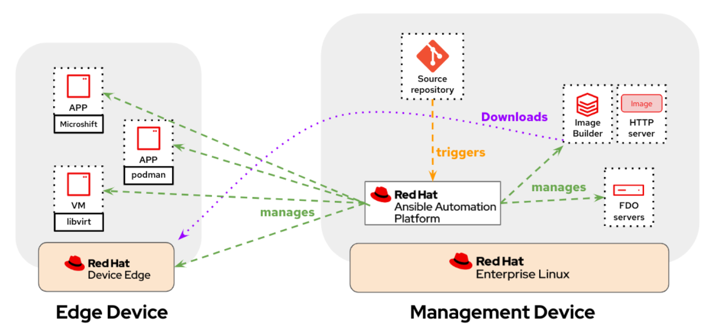

# Ansible Collection - luisarizmendi.rh_edge_mgmt

This Ansible Collection helps installing and configuring the following architecture for demos and PoCs:



## TL/DR

If you need a quick deployment and you don't want to expend time reading the role documentation, try this:

1. You need to install the [Ansible Collection](https://github.com/luisarizmendi/rh_edge_mgmt) on your laptop (of course you will also need `ansible` and `ansible-galaxy`)

```shell
ansible-galaxy collection install luisarizmendi.rh_edge_mgmt
```

2. Clone this repo and move into the `docs/example` directory

```shell
git clone https://github.com/luisarizmendi/rh_edge_mgmt
cd rh_edge_mgmt/docs/example
```

3. Obtain the AAP Manifest file following the steps that you [find in this section of the setup role](roles/setup_rh_edge_mgmt_node/README.md#ansible-automation-platform-manifest) and place it in the directory `files` with the name `manifest.zip`.


4. Create a new Ansible vault file in the `vars` directory (remember the password that you configure):

```shell
ansible-vault create vars/secrets.yml
```

5. In that file, add your Red Hat account username and password, the pull-secret ([obtain it here](https://cloud.redhat.com/openshift/install/pull-secret)) and a Red Hat offline ([obtain it here](https://access.redhat.com/management/api)) token following variables:

```shell
pull_secret: '<your pull secret>'
offline_token: '<your offline token>'
red_hat_user: <your RHN user>
red_hat_password: <your RHN password>
```

6. Add the target host where you will install the management services (Ansible Automation Platform, Event Driven Automation, Gitea and Image-Builder) in the `inventory` file. This must be a RHEL 9 (the collection was tested with 9.3) and that system must have a valid Red Hat Subscription in place. Remember to configure passwordless access to the username that you use for access the node and run the ansible playbooks (or configure a valid sudo password in the inventory file).

```shell
vi inventory
```

7. Run the playbook that uses the roles and include the secrets in the Vault file

```shell
ansible-playbook -vvi inventory --ask-vault-pass playbooks/main.yml
```

8. Wait until the playbook finish and, after a couple of minutes, you will be able to access the deployed services in the target host with the default user/password (there are 3 users created by default, the first one is `user1`):

* Ansible Automation Platform Controller: 8080 (HTTP) / 8443 (HTTPS) - `user<number>/password<number>`
* Ansible Automation Platform Event-Driven Ansible Controller: 8082 (HTTP) / 8445 (HTTPS) - `admin/R3dh4t1!`
* Cockpit: 9090  - `admin/R3dh4t1!`
* Gitea: 3000 - `user<number>/password<number>`


9. You can now follow the [example demo steps](docs/example/README.md#demo-steps).


<br><br>


## Roles

The collection is composed by two main roles:

* [setup_rh_edge-mgmt-node](roles/setup_rh_edge_mgmt_node/README.md) that deploys RHDE management services

This Ansible Role was created to be used as a simple way of deploying all Management components that you would need to run a Red Hat Edge Management DEMO:

* Image Builder
* FDO Servers
* Ansible Automation Platform (Controller, Hub and Event Driven Automation)
* Gitea

* [config_rh_edge-mgmt-node](roles/config_rh_edge_mgmt_node/README.md)  that configures those services

This Ansible Role was created to be used as a simple way of configuring the following components that you would need to run a Red Hat Edge Management DEMO:

* Ansible Automation Platform (Controller and Event Driven Automation)
* Gitea

## Pre-requisites

### Ansible Collection

You need to install the [Ansible Collection](https://github.com/luisarizmendi/rh_edge_mgmt) on your laptop:

```shell
ansible-galaxy collection install luisarizmendi.rh_edge_mgmt
```

### Hardware requirements

I've been able to deploy everything on a VM with 4 vCores and 10GB of memory. Storage will depend on the number of RHDE images that you generate.

### Subscribed RHEL System

You need a server with RHEL 9 installed (the collection has been tested with RHEL 9.3) that will be the target node (selected in the Ansible inventory) where installing the services. It must be registered with a valid Red Hat Subscription.

### Roles pre-requisites

This is the summary of the pre-requisites (all for installing the services):

* Ansible Automation Platform Manifest file
* Red Hat Customer Portal Offline Token
* Red Hat Pull Secret
* Red Hat User and Password

You can find more details about them in the role README file:

* [setup_rh_edge_mgmt_node role](roles/setup_rh_edge_mgmt_node/README.md)

You can also take a look at the pre-requistes of the config role, but mainly is demo config customization

* [config_rh_edge_mgmt_node role](roles/config_rh_edge_mgmt_node/README.md)

  >**Note**
  >
  > You can ignore the additional Collections installation since those should be installed as part of the `luisarizmendi.rh_edge_mgmt` collection install.


### Ansible inventory and playbook

Prepare the Ansible inventory file and the variables in the `main.yml` playbook as explained in the roles README files, for example:

```yaml
---
- name: RHDE and AAP Demo
  hosts:
    - edge_management
  tasks:
    - name: Install management node
      ansible.builtin.include_role:
        name: luisarizmendi.rh_edge_mgmt.setup_rh_edge_mgmt_node

    - name: Config management node
      ansible.builtin.include_role:
        name: luisarizmendi.rh_edge_mgmt.config_rh_edge_mgmt_node
      vars:
        gitea_admin_repos_template: ../templates/gitea_admin_repos
        gitea_user_repos_template: ../templates/gitea_user_repos
        aap_config_template: ../templates/aap_config.j2
        aap_repo_name: aap
```

Be sure that you include all secrets, preferably using an Ansible Vault file by adding `--ask-vault-pass` while launching the script:

```shell
ansible-playbook -vvi inventory --ask-vault-pass playbooks/main.yml
```


## Demo example

You have a base [demo example under docs/example](docs/example/README.md) that you can use as starting point.

